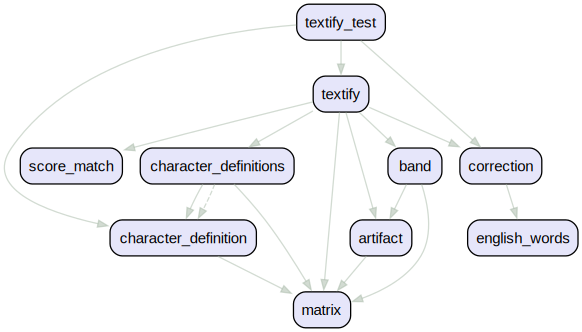

# Textify (OCR)

Textify is a Dart package that provides utilities for working with text representations in a specific character set. It is designed to handle text processing tasks for the English language and a limited set of characters.

 It is 100% cross-platform, utilizing native Dart and Flutter code, and works offline without any package dependencies.

## Why Textify?

Textify addresses common limitations of existing OCR (Optical Character Recognition) solutions:

1. Lightweight: Most OCR libraries are heavy and often rely on external system dependencies or remote cloud services, complicating deployment and increasing costs.

2. Simplified Setup: Popular solutions like Tesseract require complex build configurations, including C/C++ compilation, which can be difficult to manage across platforms.

3. Web Compatibility: Many OCR solutions do not support Flutter web clients, limiting their cross-platform usability.

Textify overcomes these issues with a lightweight, pure Dart implementation that works seamlessly across all Flutter platforms, including web, without external dependencies.

## Installation

Add this to your package's `pubspec.yaml` file:

```yaml
dependencies:
  textify:
```

Then run:

```bash
flutter pub get
```

## How to use

Here's a basic example of how to use Textify:

``` dart
import 'package:textify/textify.dart';

// load your image
ui.Image inputImage = await loadImage('scan.png');

// instentiate Textify once
Textify textify = await Textify().init();

// extract text from the image
String extractedText = await textify.getTextFromImage(image: inputImage);

print(text);

```

## Features

- Extracts text from [clean digital images](#input-image---clean-digital-image-guidelines)
- Supports standard fonts like "Arial", "Courier", "Helvetica", "Times New Roman"
- Fully cross-platform
- Pure Dart and Flutter implementation
- Offline functionality
- No external package dependencies

## Limitations

- Supported for [clean digital images](#input-image---clean-digital-image-guidelines) (no handwriting)
- Limited character set support
- No support for special formatting (italic, variable size etc.)
- Text must be free of images and framing (aka no borders)

## Supported Characters

This package currently supports the following characters, with plans to expand support in the future:

- Uppercase letters: `ABCDEFGHIJKLMNOPQRSTUVWXYZ`
- Lowercase letters: `abcdefghijklmnopqrstuvwxyz`
- Digits: `0123456789`
- Punctuation marks: `/\(){}[]<>,;:.!@#$&*-+=?`

While the current character set is limited, future updates will aim to include broader language support, starting with common accented characters and symbols.

## Input image - Clean Digital Image Guidelines

### What Makes a Clean Digital Image?


#### Font Selection

- Use Helvetica (sans-serif) or Courier (monospace)
- Keep font size consistent and large (12pt+ size)
- Maintain uniform character width, especially with Courier

#### Text Spacing Requirements

- Letters must not touch or overlap
- Maintain consistent gaps between words
- Use standard line spacing (1.5 recommended)
- Keep clear margins around text

#### Best Practices

- Clean, computer-generated documents
- Scanned image of high resolution: Minimum 300+ DPI
- Format: TIFF or PNG preferred
- Use OCR-friendly fonts
- High contrast between text and background
- Clean, white background
- Black text for optimal readability
- Remove any background noise or artifacts
- Keep text alignment consistent
- Avoid decorative or script fonts
- Minimal background noise (e.g., no watermarks)
- High contrast between text and background
- No handwritten or italic text
- Isolated characters (not touching other artifacts)

#### Quick Validation Checklist

- [X] Text is clearly separated
- [X] Fonts are similar to Helvetica, Courier, Times New Roman
- [X] Size is consistent throughout
- [X] No touching characters
- [X] Clean background
- [X] High contrast
- [X] Proper resolution

## Language Support

Textify is currently designed to work with the English language only. While it may handle some text in other languages that use the supported character set, its functionality is optimized and intended for English text processing.

## Components



Please contribute and report issues on the GitHub repository.
<https://github.com/vteam-com/textify>
